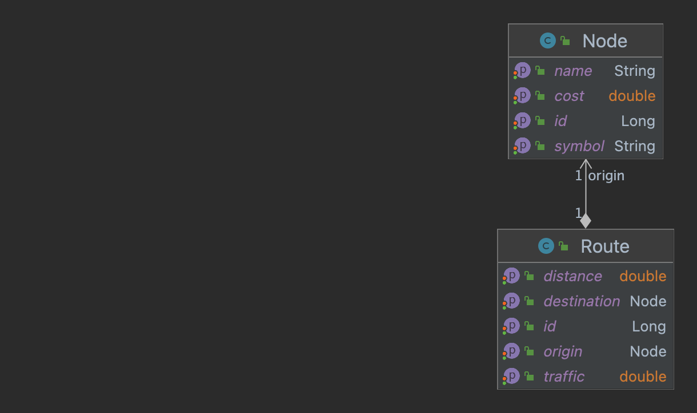

# DHS - Offsite Java Assignment

## Project Information
* The aim of this assignment is to find the shortest path from a specific node(earth) to the given destination
* For implementing this, BFS method and Dijkstra algorithm is used, also Priority Queue is used that leads time complexity would be O (V + E l o g V).
* Technologies that are used here are : Java 19, Spring Boot, H2 database, OpenAPI 3.0 and Mockito
* In this Project, we read our data from an Excel file, that contains a graph information, such as nodes, routes .
* Data from Excel file is written to H2 database in 2 tables Node and Route after running the project, H2 console
  is accessible from : [H2 Console](http://localhost:8080/h2-console) (_user:sa, password:password_)
* Class **DataLoader** is responsible for transferring data from Excel file to the DB, when the program starts.
* Entity Data Model:

* Class **GraphService** is responsible for executing algorithm on dataSet based on source and destination parameters.
* Class **GraphController** is a REST controller for handling http-requests for calling REST services 
* Two rest services are implemented :
  * One for getting the minimum distance from Origin(Earth node to the given Node
  * And another one for getting the shortest path from Origin(Earth node to the given Node
* REST Api documentation can be found from [API Documentation](http://localhost:8080/swagger-ui/index.html) 
* For the restController and service unit tests are written,the class names are : **GraphControllerTest** and **GraphServiceTest**
* For REST Api, class **RestExceptionHandler**, is implemented to handle Api exceptions with user-friendly message format

### How to run?
* Extracting project zip folder
* Using command : _java -jar target/ShortestPath-0.0.1-SNAPSHOT.jar_ from command line in the folder directory

### Upcoming changes
* Adding security for calling REST Apis, using spring security, oath2 or ...
* Adding service classes for Node and Route, also add REST apis for doing CRUD operations on these entities.
* Adding cache layer for **GraphController** apis.
* Implementing user interface in order to user can choose destination from the UI and see the shortest distance and 
shortest path
* Conveying _traffic_ field in calculating shortest path
* Containerize project via docker.